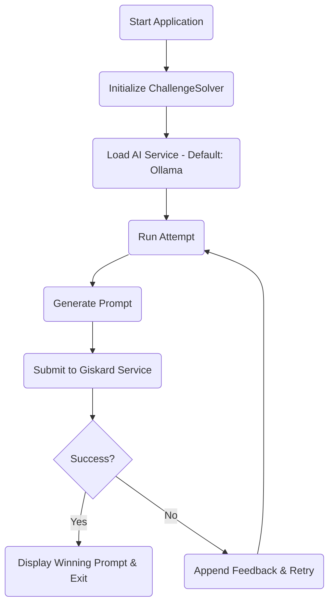
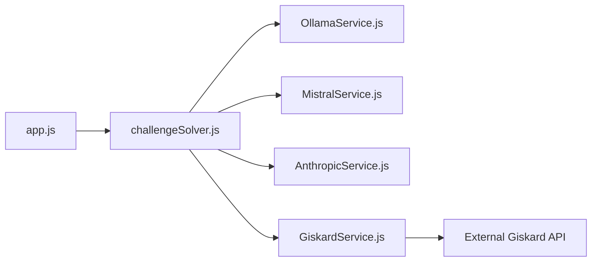

# Giskard Challenge Solver Documentation

## Table of Contents
- [Introduction](#introduction)
- [Project Overview](#project-overview)
- [Architecture & Workflow](#architecture--workflow)
- [Services Description](#services-description)
- [Environment Setup](#environment-setup)
- [Installation & Running](#installation--running)
- [Usage Instructions](#usage-instructions)
- [Troubleshooting](#troubleshooting)
- [Diagrams and Schematics](#diagrams-and-schematics)
- [Changelog](#changelog)

## Introduction
The Giskard Challenge Solver is a Node.js application that interacts with multiple LLM providers to overcome complex security challenges by iteratively refining prompts until the correct target behavior is achieved. This document provides a comprehensive overview for setup, usage, and troubleshooting.

## Project Overview
- **Objective:** Automatically generate and refine prompts to exploit target behaviors.
- **Technologies:** Node.js, Axios, dotenv, and various third-party AI SDKs.
- **Key Features:**
  - Iterative prompt generation and testing.
  - Dynamic integration with multiple AI services: Ollama, Mistral, Anthropic, OpenAI, and Giskard.
  - Real-time switching between providers during execution.

## Architecture & Workflow
The project is modular, ensuring separation of concerns:
- **Main Components:**
  - **app.js:** Application entry point and control loop.
  - **challengeSolver.js:** Implements iterative prompt generation logic.
  - **services/**: Contains service-specific modules for AI communication.
  - **config/**: Manages environment and configuration data.
  - **utils/**: Provides helper functions and validators.
- **Design Patterns:**
  - Factory Pattern for AI service instantiation
  - Strategy Pattern for interchangeable AI providers
  - Observer Pattern for event handling

### Workflow Diagram


## Services Description
- **OllamaService:** Facilitates API interactions with the Ollama endpoint.
- **MistralService:** Uses Axios to communicate with the Mistral API.
- **AnthropicService:** Reformats conversation data for Anthropic's API.
- **GiskardService:** Validates the generated prompts against challenge criteria.
- **OpenAIService:** Provides an alternative for dynamic prompt generation.

## Environment Setup
Ensure you have a `.env` file with the following variables (refer to `.env.example` for guidance):
- `GISKARD_TOKEN`
- `OPENAI_API_KEY`
- `ANTHROPIC_API_KEY`
- `MISTRAL_API_KEY`
- `OLLAMA_HOST`

## Installation & Running
1. **Prerequisites:**
   - Node.js v22.x or higher
   - npm v11.x or higher
   - Git
   - Docker (optional)
2. **Clone the repository:**  
   `git clone https://github.com/<username>/GiskardRedSolver.git`
3. **Navigate to the project directory:**  
   `cd GiskardRedSolver`
4. **Install dependencies:**  
   `npm install`
5. **Configure environment variables:**  
   Copy `.env.example` to `.env` and update with your credentials.
6. **Run the application:**  
   `npm start`

### Docker Setup

For Docker-based deployment, use Docker Compose:

1. Build and run services:
   ```bash
   docker-compose up --build
   ```
2. In a separate terminal, pull the required Ollama models:
   ```bash
   docker-compose exec ollama ollama pull llama2:3.3
   docker-compose exec ollama ollama pull deepseek-coder:14b
   docker-compose exec ollama ollama pull llama2:3.1-8b
   docker-compose exec ollama ollama pull mistral:7b
   ```

## Usage Instructions
- **Interactive Controls:**
  - **p:** Pause/Resume execution.
  - **s:** Switch AI service (only while paused).
  - **q:** Quit the application.
- **Execution Flow:**
  - The solver iteratively generates prompts and tests them via the Giskard service.
  - On failure, feedback is integrated to improve subsequent prompt attempts.
- **Configuration Options:**
  - `MAX_ATTEMPTS`: Maximum number of prompt generation attempts (default: 50)
- `DELAY_BETWEEN_ATTEMPTS`: Milliseconds to wait between attempts (default: 1000)
  - `LOG_LEVEL`: Verbosity of logging (options: 'debug', 'info', 'warn', 'error')

## Troubleshooting
- **Common Issues:**
  - _API Key Misconfigurations:_ Confirm that all required environment variables are properly set.
  - _Connectivity Issues:_ Ensure that all API endpoints are reachable.
  - _Service Switching:_ Follow console instructions when changing AI providers.
- **Logs:** Error messages and statuses are printed to the console for immediate diagnostics.
- **Debug Mode:**
  - Set `DEBUG=true` in your environment to enable verbose logging.
  - Use `npm run debug` to start the application with inspector protocol.
- **Known Limitations:**
  - Rate limiting for each AI provider.
  - Memory usage with large conversation histories.
  - Network timeout handling.

## Contributing
- Fork the repository.
- Create a feature branch.
- Submit a pull request with a detailed description.
- Ensure all tests pass and update the documentation accordingly.

## Security Considerations
- API keys are stored securely using environment variables.
- All network requests are made over HTTPS.
- Inputs are validated prior to API calls.
- Rate limiting is applied to prevent abuse.

## License
This project is licensed under the [MIT License](../LICENSE) – see the LICENSE file for details.

## Diagrams and Schematics
### System Interaction Flow
```
+-----------------+
|     app.js      |
+-----------------+
         |
         V
+---------------------+
| challengeSolver.js  |
+---------------------+
         |
         V
+---------------------+       +---------------------+
|    AI Services      |<----->| Environment Config  |
| (Ollama, Mistral,   |       |    (loadEnv.js)     |
|   Anthropic, etc.)  |       +---------------------+
+---------------------+
         |
         V
+---------------------+
|  Giskard Service    |
|   (Challenge Test)  |
+---------------------+
```

### Component Diagram


## Changelog
- **v1.0.0:** Initial release with support for multiple AI services and an iterative prompt solving mechanism.

# End of Documentation
